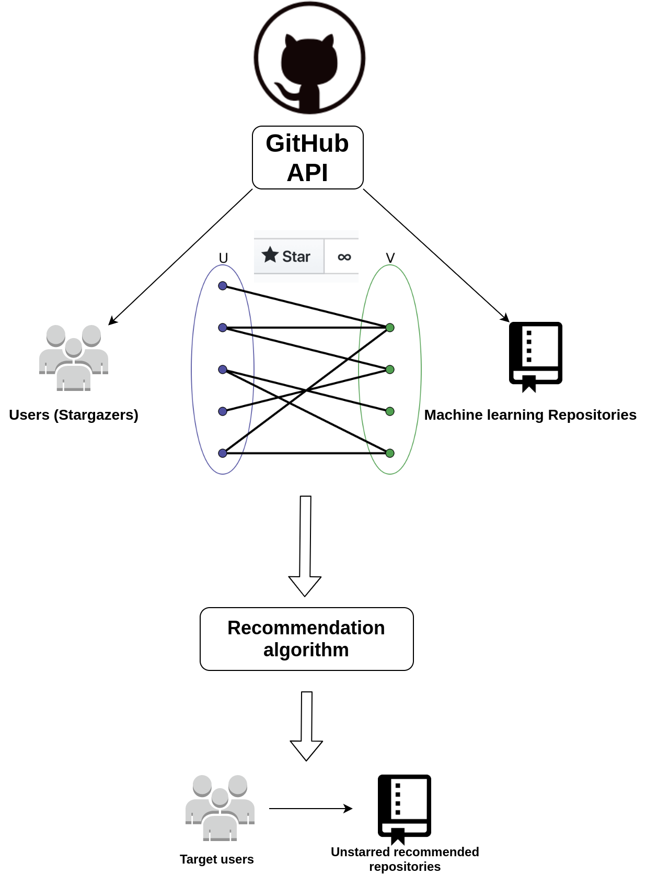

# A graph-based Github recommendation system for machine learning repositories

## Task
Implement a graph-based recommendation system for GitHub. Particularly we
recommend repositories for a target user that he may find useful or even want to contribute to, by
utilizing his previous starred repositories.

## Project setup

Create virtual environment

```
$ python3 -m venv venv
$ source venv/bin/activate
```

Upgrade pip

```
$ python -m pip install --upgrade pip
```

Install dependencies

```
$ pip install -r requirements.txt
```

## Architecture

The overall architecture of the recommendation system is shown below:



## Dataset
For the constructed dataset we utilize the GitHub API to gather users that have given a star (stargazers)
to specific repositories.

To end up with a relatively dense graph the criteria for the seed repositories (i.e. the repos
from which we will gather the corresponding users) are the following:

1. Topic is “Machine Learning”
2. Main language of repositories is “Python”
3. Each repository has at least 1000 stars.

The results are **250 seed repositories**.

Those seed repos are available at `data/repos.json`

For these repos we gather using the API the corresponding stargazers.

From all the collected users, we keep only the top users according to their given stars to 
the seed repos, in three flavors: top-3000, top-6000, top-9000.

For the complete dataset with the repositories and their corresponding users 
please contact the contributors of this repository.

## Recommendation algorithm

After constructing the bipartite graph from the above dataset,
we implemented a *random-walk* algorithm. Particularly given a target 
user for which we want to recommend new repositories, we find the neighbors
of the user that correspond to the repositories that have already received a star by the user.
These repositories are set as the seed repositories for the recommendation
and will be used as the starting point of the random walks that will be conducted over the bipartite graph.

The parameters of our algorithm are `random_walks_per_repo` and `double_steps_per_random_walk`.

The evaluation is based on the *Precision* and *Recall* metrics.

## Demonstration of the system

The `k` value is the parameter for requesting *top-k* repositories to be recommended 
for a target user. Particularly by modifying the target users and the `topk`
value in `recommendation/random_walk.py` you can request recommended
machine learning repositories for those target users that they haven't
already starred.

To run it:

```
$ cd recommendation/
$ python random_walk.py

```

Example output:

```
For GitHub user: fly51fly, the top-10 recommended repositories are ['datamade/usaddress']
    
For GitHub user: gaomingweig, the top-10 recommended repositories are ['deepfakes/faceswap', 'flairNLP/flair', 'RasaHQ/rasa', 'stanfordnlp/stanza', 'microsoft/nni', 'microsoft/nlp-recipes', 'iterative/dvc', 'alteryx/featuretools', 'streamlit/streamlit', 'lanpa/tensorboardX']
    
For GitHub user: izdi, the top-10 recommended repositories are ['PyTorchLightning/pytorch-lightning', 'microsoft/nni', 'scikit-learn/scikit-learn', 'ddbourgin/numpy-ml', 'ageitgey/face\_recognition', 'tensorflow/tensor2tensor', 'pyro-ppl/pyro', 'RasaHQ/rasa', 'JaidedAI/EasyOCR', 'PaddlePaddle/Paddle']

```
